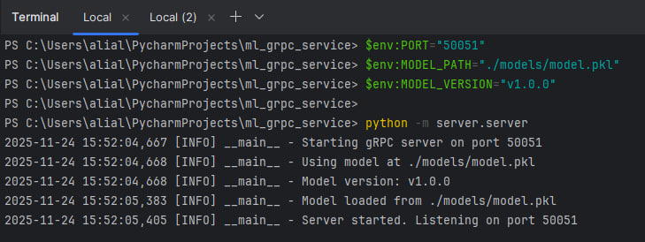
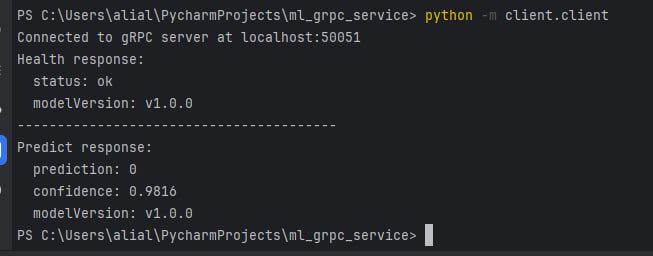
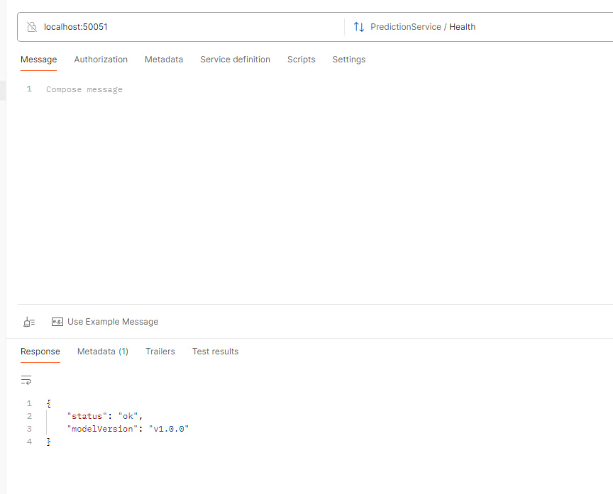
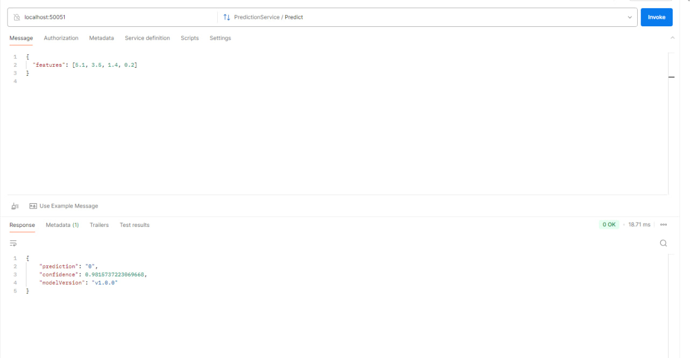
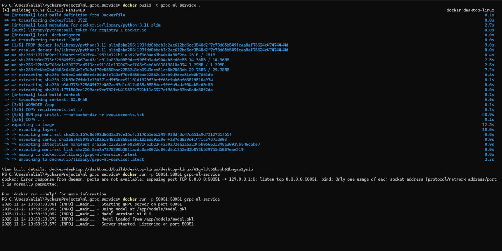

# gRPC ML Service — Health & Predict Endpoints  
Домашнее задание №2. gRPC-сервис для инференса ML-модели.

---

##  Цель проекта
Реализовать минимальный, но полноценный gRPC-ML сервис с двумя методами:

- **/health** — проверка статуса сервиса и версии модели.
- **/predict** — получение предсказания модели и confidence.

Сервис разворачивается в Docker, модель подгружается из `model.pkl`.  
Проект полностью готов к локальному запуску и проверке через Postman или grpcurl.

---

## Структура проекта

```text
ml_grpc_service/
├── protos/
│   ├── model.proto
│   ├── model_pb2.py
│   ├── model_pb2_grpc.py
│   └── __init__.py
├── server/
│   ├── server.py
│   └── __init__.py
├── client/
│   ├── client.py
│   └── __init__.py
├── models/
│   ├── model.pkl
│   └── train_dummy_model.py
├── requirements.txt
├── Dockerfile
├── .dockerignore
└── README.md


---











